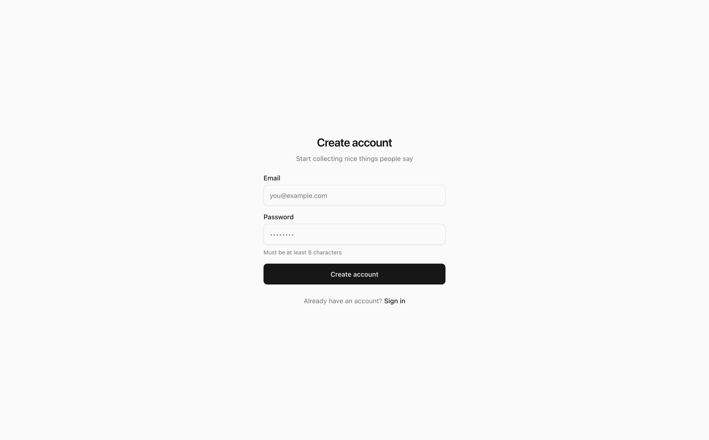
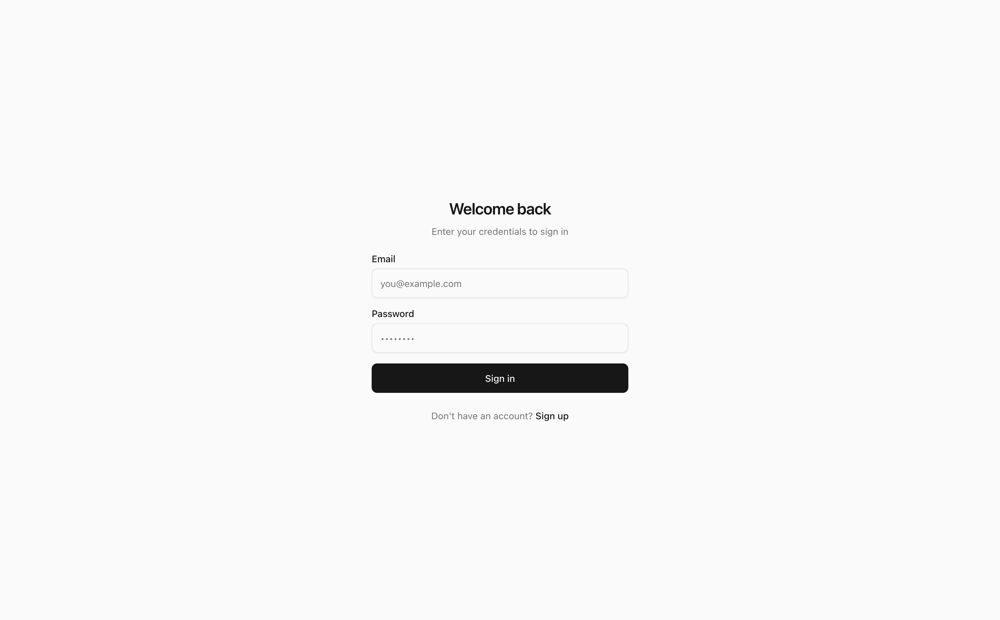
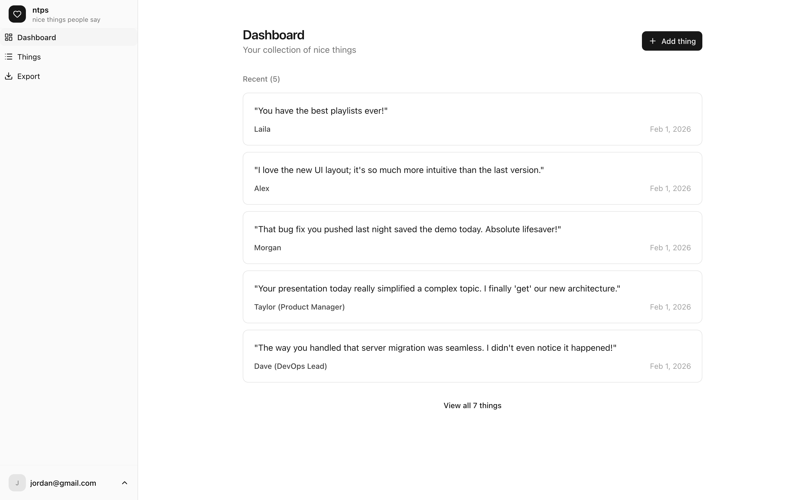
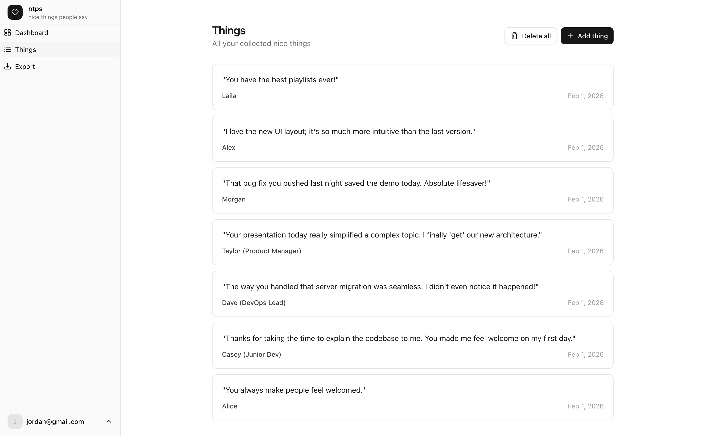
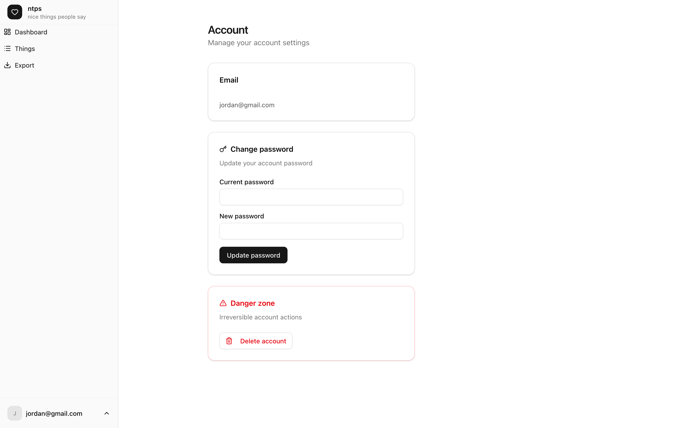
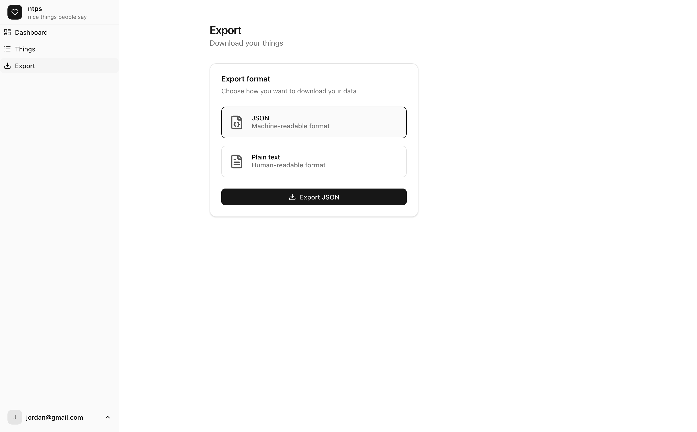
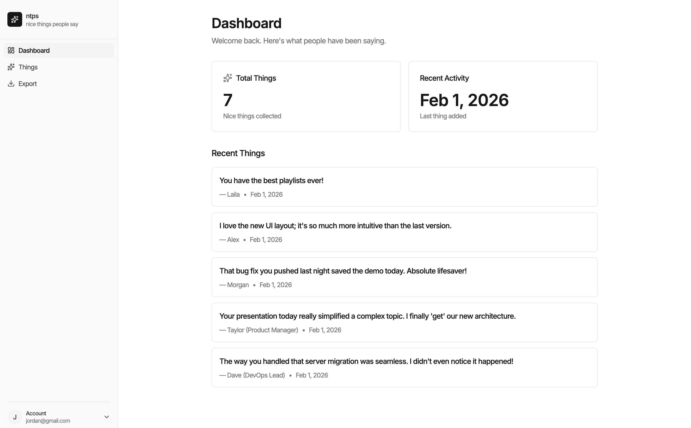
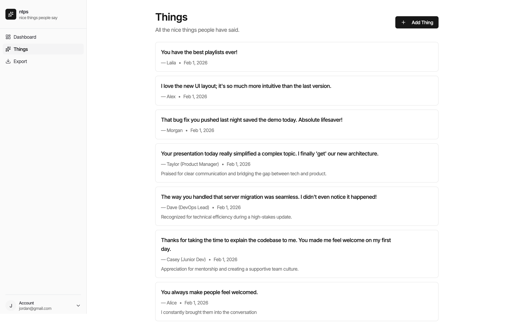
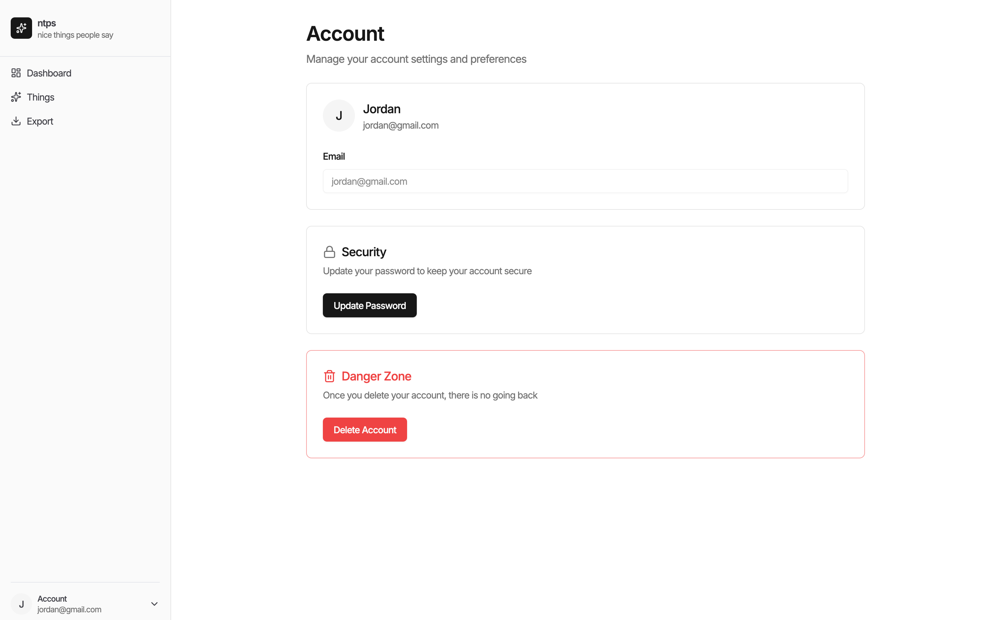
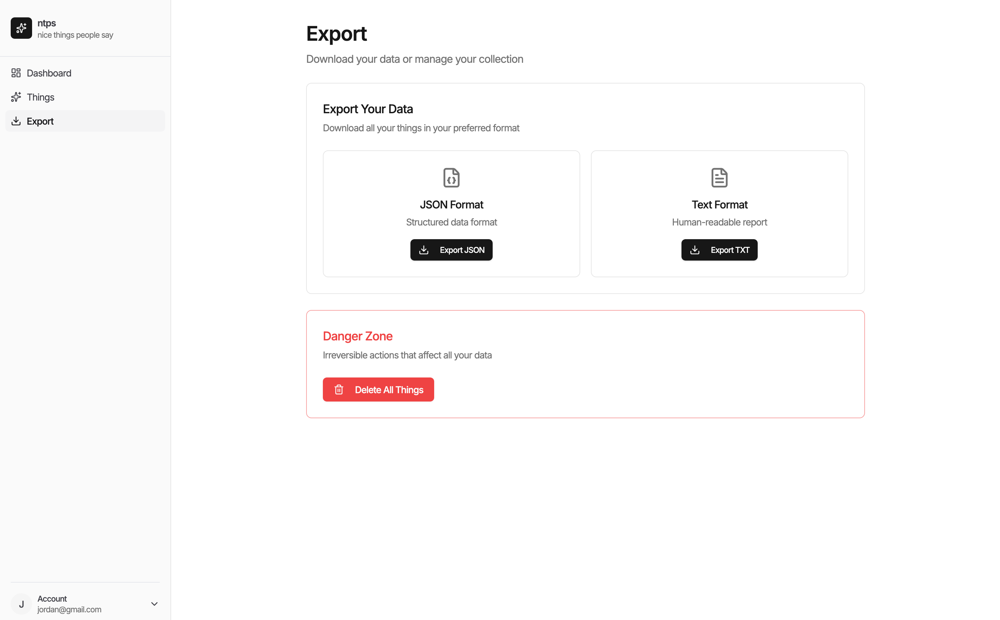

# Nice Things People Say (NTPS)

A small mindfulness app for saving kind words you receive — and revisiting them later.

Users can record:

* **What someone said**
* **Who said it**
* **Why they said it** (optional)

Entries are automatically dated and stored. Over time, this becomes a personal collection of positive moments you can reflect on anytime.

---

## ✨ Purpose

Life moves fast. Compliments and kind words fade from memory.

NTPS exists to help you **capture small positive moments** so you can return to them when you need encouragement, perspective, or gratitude.

---

## 🧱 Tech Stack

**Backend**

* Node.js
* Express
* MongoDB + Mongoose
* JWT auth (httpOnly cookies)

**Frontend**

* Next.js + React
* Zustand
* shadcn/ui + TailwindCSS
* Framer Motion

---

## 🤖 AI-Assisted Development

The frontend was generated and iterated using structured prompts with multiple AI models.

All requirements, API contracts, state shape, and UI structure are defined in **[PROMPT.md](./PROMPT.md)**, which serves as the source of truth used to produce the frontend codebase.

Testing with more AI models coming soon (Deepseek, GPT, Gemini, Copilot and more).

---

## 🔐 Core Features

* User authentication
* Create, view, edit, and delete “nice things”
* Personal dashboard and full history
* Export entries as JSON or plaintext

---

## 🖼 Screenshots

**Here's what Kimi 2.5 generated:**

### Signup



### Login



### Dashboard



### Things List



### Account




### Export




**Here's what Claude 4.5 generated:**


### Dashboard



### Things List



### Account




### Export


---

## 🧠 Philosophy

Minimal. Calm. Distraction-free.

This app is intentionally simple — the focus is reflection, not features.

---

## 🚀 Running Locally

### Backend

```bash
cd server
pnpm install
pnpm dev
```

### Frontend
Move into the directory of which frontend implementation you wish to view. (claude, kimi 2.5 or grok)
```bash
cd claude
pnpm install
pnpm dev
```

---

Made with care to help people remember the good.
